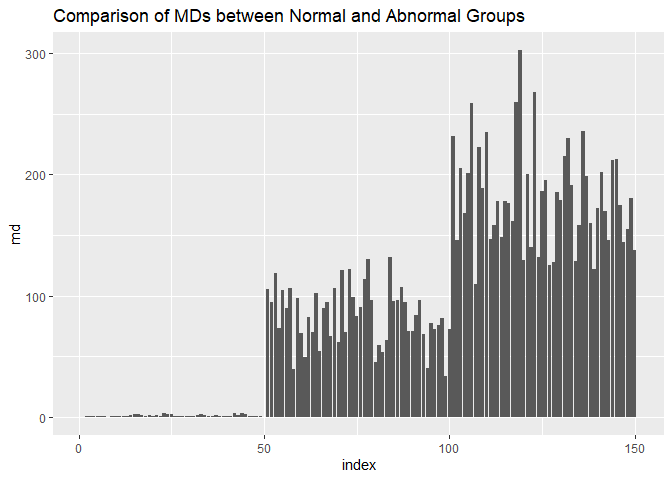

<!-- README.md is generated from README.Rmd. Please edit that file -->

# easyMTS

<!-- badges: start -->

<!-- badges: end -->

The Mahalanobis-Taguchi System (MTS) helps you create a diagnostic
system to detect abnormality. In MTS, we characterize a group of
multivariate reference observations to establish the bounds for what
“good” means, and use that characterization to diagnose new
observations. In addition to diagnostics, MTS can also be used for
classification and prediction – but it’s not a classifier per se. MTS
doesn’t attempt to split observations into multiple groups, it just
tells you whether your new observation matches the data in your training
set (or not).

## Mahalanobis Distance

Euclidean distance measures the straight-line distance between two
points. In contrast, Mahalanobis distance is measured between a *point*
and a *distribution* of values. It is thus a multivariate distance
measure that describes how many standard deviations the point is away
from the center of the “cloud” that forms the distribution. But if the
variables are related to each other (for example, like how drunkness
increases as number of drinks increases) then you might be counting the
same impact multiple times. Mahalanobis distance provides a distance
measure that’s better, given that there are multiple variables to
consider in determining that distance.

If the point can be described by its coordinates in n dimensions:

  
")  

And the distribution has one mean for each independent variable:

  
")  

The Mahalanobis Distance (MD) is calculated like this:

  
 = \\sqrt{ (\\vec{x}-\\vec{\\mu})^T\\:S^{-1}\\: (\\vec{x}-\\vec{\\mu}) }")  

The initial term under the square root is the transposed matrix
containing the differences between the x’s and the column (independent
variable) means.

indicates the inverse of the correlation matrix. Fortunately all of
these things are easy to calculate in R, and there’s also a function to
generate MDs from a multivariate data frame.

This package uses the **scaled Mahalanobis Distance** recommended by
Yang & Trewn (2004):

  
^2 = \\frac{1}{p} { (\\vec{x}-\\vec{\\mu})^T\\:S^{-1}\\: (\\vec{x}-\\vec{\\mu}) }")  

## Steps in MTS Development and Validation

The steps to apply MTS are:

  - Create a *UNIT SPACE* from “good” or “healthy” observations that
    will form the reference group
      - Select a representative sample of observations and create a data
        frame containing those observations
      - Normalize the values in the data frame to z-scores
      - Construct a correlation matrix of the normalized values
      - Invert the result
      - Compute one Mahalanobis Distance (MD) for each observation (each
        row of the data frame)
  - Confirm *DISCRIMINATORY POWER* of MD by doing the same with the
    “bad” or “unhealthy” observations
      - Calculate MD for the “bad” or “unhealthy” group using procedure
        above
      - Plot the MDs for the two groups to see if there is
        discriminatory power (e.g. using a comparative boxplot)
      - You can also plot the sequence of MDs on an I-MR control chart
        to find where values become “out of bounds”
  - Perform *FEATURE ENGINEERING* to reduce the dataset to the variables
    that best suggest “good” or “bad” observations
      - This is usually done using a *Taguchi orthogonal array* based on
        the number of factors you are considering
      - Recalculate the MDs using subsets of the independent variables
        (e.g. 8 experimental runs for 4 IVs)
      - For each experimental run, find the average of the SNs for the
        IVs you used vs. the ones you didn’t use
      - Calculate & plot “gain” for each experimental run (which is the
        difference between Level 1 and Level 2 means)
      - If the SN drops under the Level 2 condition (that is, not using
        that particular IV), don’t use that factor
      - Generate the SNs again for your reduced model, and compare how
        the SNs have changed (e.g. boxplots)
  - Collect new observations and *USE THE SYSTEM* to determine whether
    new observations are “good” or “bad”
      - Calculate the MD for a new observation and see if it matches the
        “good” group
      - If not, your observation is “not nominal” – but no way to tell
        whether it’s super bad or super good

## Functions in this Package

  - *computeMDs* - This function computes Mahalanobis Distances (MDs)
    for “good” and “bad” groups. Takes two arguments: the good data
    frame, and the bad data frame. They must have one column per
    predictor/independent variable, and columns must be the same between
    the two files. The number of rows in each file can, and will usually
    be, different from one another.
  - *plotMDs* - Plots Mahalanobis Distances from good and bad groups,
    using index of observation on horizontal axis. Takes as input the
    output from computeMDs. Optional argument “type” can be hc\_scatter
    or hc\_column; default is ggplot bar chart.
  - *generateTDO* - Generates Taguchi Orthogonal Array Design Object
    (TDO) from an integer number of anticipated predictors/independent
    variables OR either of the “good” or “bad” data frames of sample
    observations.
  - *ltb, stb, dyn.sn* - Taguchi Signal-to-Noise formulas for
    larger-the-better, smaller-the-better, and dynamic (smaller-larger).
  - *runTaguchi* - This function processes the good and bad observations
    using the TDO as a frame of reference. Yields a data frame with one
    row per Taguchi experiment, one column per “bad” observation.
  - *addSN* - Adds a Taguchi SN column to output from runTaguchi.
  - *calcGains* - Computes the average SN for each predictor, depending
    upon whether or not it was used in the Taguchi experiment.
  - *plotGains* - Plots the output of calcGains. Negative gain indicates
    that the predictor does not enhance the discriminatory power of the
    MTS. Optional argument “type” can be set to “maineffects” for a
    maineffects plot across all predictors, “hc\_scatter” or
    “hc\_column”. Default is ggplot barplot.
  - *recommend* - Using data frame output from calcGains, this function
    lists the variables that should be used in the final diagnostic
    model. Optional argument “type” can be set to “pretty” for aesthetic
    formatting in Rmd reports.

## Example

Here is a quick example using the iris data. This only prepares and
plots distances from a collection of good observations and a collection
of bad observations. Each collection must have the same number of
columns (predictors) but they can have a different number of rows
(observations):

``` r
library(easyMTS)
library(MASS)
library(dplyr)
library(magrittr)
library(ggplot2)

good <- iris[1:50,1:4]    # Setosa are "healthy" group
bad  <- iris[51:150,1:4]  # Virginica and versicolor are "unhealthy"

mds <- computeMDs(good, bad)
plotMDs(mds)
```

<!-- -->
